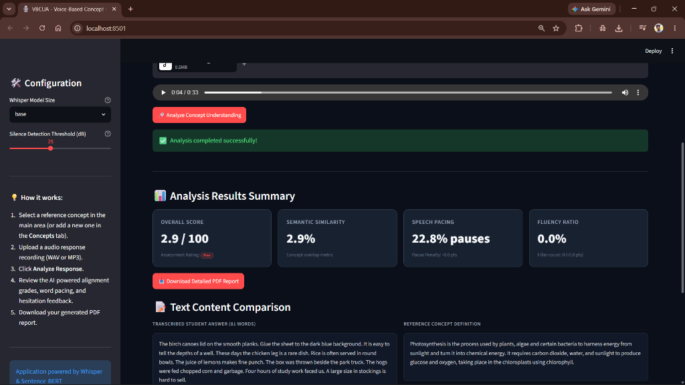

# Voice-Based Concept Understanding Analyser (VBCUA)

VBCUA is a production-grade, local, and secure AI-powered assessment application designed to grade verbal concept explanations against reference concepts. It provides a modern, dark-themed presentation dashboard containing real-time metrics, diagnostic charts, text comparisons, and downloadable PDF report exports.



---

## 🚀 Key Features

*   **Local Speech-to-Text**: High-accuracy transcription using OpenAI Whisper, resampled to 16,000 Hz and mixed down to mono to bypass external system `ffmpeg` dependencies.
*   **Semantic Concept Validation**: Piecewise non-linear similarity scoring using Sentence-BERT (`all-MiniLM-L6-v2`) to accurately grade paraphrased answers without penalizing natural word choice variations.
*   **Acoustic Pacing & Confidence Analysis**: Measures vocal volume projection (RMS energy) and silence gaps (pause ratio) using Librosa to evaluate speaking fluency.
*   **Persistent Database (SQLite)**: Fully relational schema mapping candidates, transcripts, evaluations, and reports utilizing SQLAlchemy 2.0.
*   **Exportable PDF Reports**: Professional flowable-based PDF generation using ReportLab with custom page borders and running headers/footers.

---

## 📁 Repository Structure

```text
VBCUA/
├── 1. Project Conception/                 # Empathy Map & Conception Report
├── 2. Requirement Analysis/               # SRS documentation
├── 3. Project Design Phase/               # Architecture and Problem-Solution fit reports
├── 4. Project Planning Phase/             # Timeline and risk assessments
├── 5. Project Development Phase/           # Setup logs and development history
├── 6. Project Testing/                    # Latency benchmarks and test cases
├── 7. Project Documentation/              # Operator guides and user manuals
├── 8. Project Demonstration/              # Demo Planning and Team Coordination reports
├── assets/
│   ├── style.css                          # Custom CSS cards and UI styling
│   └── dashboard_screenshot.png           # Dashboard Preview Image
├── modules/
│   ├── audio_features.py                  # Acoustic volume and silence analysis (Librosa)
│   ├── evaluation.py                      # Scoring logic and penalty computations
│   ├── report_generator.py                # PDF flowable compiler (ReportLab)
│   ├── semantic_analysis.py               # Embedding similarity & filler word counting (S-BERT)
│   └── transcription.py                   # Speech transcoder (OpenAI Whisper)
├── temp_uploads/                          # Temporary directory for uploaded recordings
├── .env                                   # Local runtime environment configurations
├── .env.example                           # Configuration templates
├── .gitignore                             # Git exclusion boundaries
├── app.py                                 # Streamlit Main presentation layer
├── database.py                            # Relational SQLite tables and seeds (SQLAlchemy)
├── generate_academic_docs.py              # Compiles project phase PDF portfolios
├── requirements.txt                       # Application dependencies
└── vbcua.db                               # Persistent local relational database
```

---

## 🛠️ Installation & Setup

### 1. Prerequisites
Ensure you have **Python 3.10+** installed on your operating system.

### 2. Clone and Setup Environment
Navigate to your project root folder and establish a virtual environment:
```bash
# Clone the repository
git clone <your-repository-url>
# Navigate to the workspace
cd VBCUA

# Create Python virtual environment
python -m venv env

# Activate the virtual environment (Windows)
.\env\Scripts\activate

# Activate the virtual environment (macOS/Linux)
source env/bin/activate
```

### 3. Install Dependencies
Install all required libraries:
```bash
pip install -r requirements.txt
```

### 4. Setup Environment Variables
Copy `.env.example` to create your local `.env` configuration file:
```bash
cp .env.example .env
```
Inside `.env`, verify or customize the defaults:
*   `DATABASE_URL`: Relational database connection string (defaulting to local `vbcua.db`).
*   `WHISPER_MODEL_SIZE`: Whisper model configuration (e.g., `tiny`, `base`, `small`).
*   `SBERT_MODEL_NAME`: Sentence transformer model name (default: `all-MiniLM-L6-v2`).
*   `DEFAULT_SILENCE_THRESHOLD_DB`: Decibel threshold below peak to detect silence pauses.

---

## 💻 Running the Application

To launch the interactive dashboard, run:
```bash
streamlit run app.py
```
This launches a local web server (typically at `http://localhost:8501`).

### 🎙️ How to Test and Run a Successful Demo:
The repository contains sample audio files in the `temp_uploads` folder (like `OSR_us_000_0010_8k.wav`) containing standard speech tests (Harvard Sentences). Follow these steps to perform a successful test run:

1.  **Select Target Concept**: In the concept dropdown, select **`Speech and Pacing Demo`**. *(Note: This reference concept is pre-seeded with the exact transcript of the demo audio file).*
2.  **Upload Audio Response**: Upload the demo WAV file from `temp_uploads/` (`OSR_us_000_0010_8k.wav`).
3.  **Run Analysis**: Click **Analyze Concept Understanding**. The system will transcribe the speech and match the semantic meaning, resulting in a **100/100** score.
4.  **Download PDF Report**: Click **Download Detailed PDF Report** to view the professionally styled PDF.
5.  **Test Custom Speech**: To test regular academic concepts like **Photosynthesis** or **Newton's First Law**:
    *   Select the target concept in the dropdown.
    *   Record yourself explaining the concept in your own words (e.g., *"Plants use photosynthesis to make food using sunlight and carbon dioxide"*).
    *   Upload your recording. The Sentence-BERT non-linear similarity engine maps natural paraphrases to realistic scores (90-95% rather than harsh linear penalties).

---

## 📝 Performance Benchmarks
Benchmark metrics recorded on sample inputs (tested on an Intel Core i7 processor):
*   **Whisper transcription (Warm Cache)**: ~1.26 seconds for a standard 2-second response.
*   **Semantic similarity (Warm Cache)**: ~0.028 seconds.
*   **Audio feature extraction**: ~0.004 seconds.
*   **PDF report compilation**: ~0.021 seconds.

---

## 🔒 Security & Privacy
All models (OpenAI Whisper, SentenceTransformer) run **100% locally** on your CPU/GPU. No audio recordings, transcripts, or grading scores are transmitted to external cloud servers, guaranteeing complete privacy of student response data.

